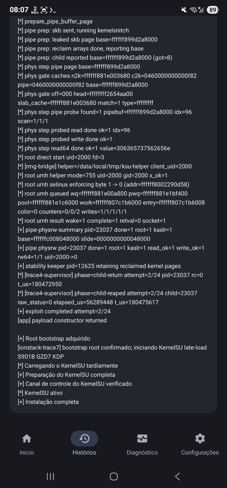
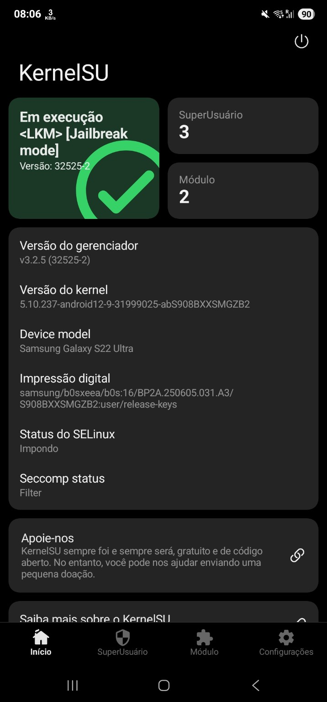
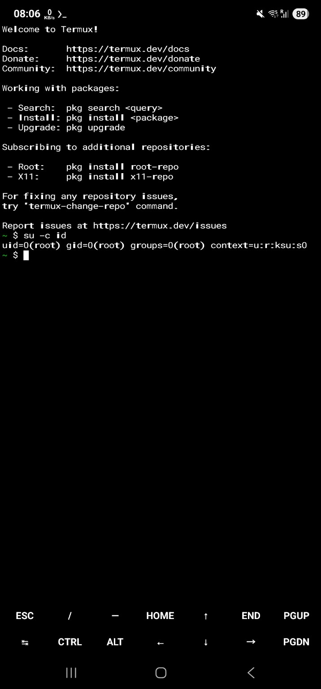
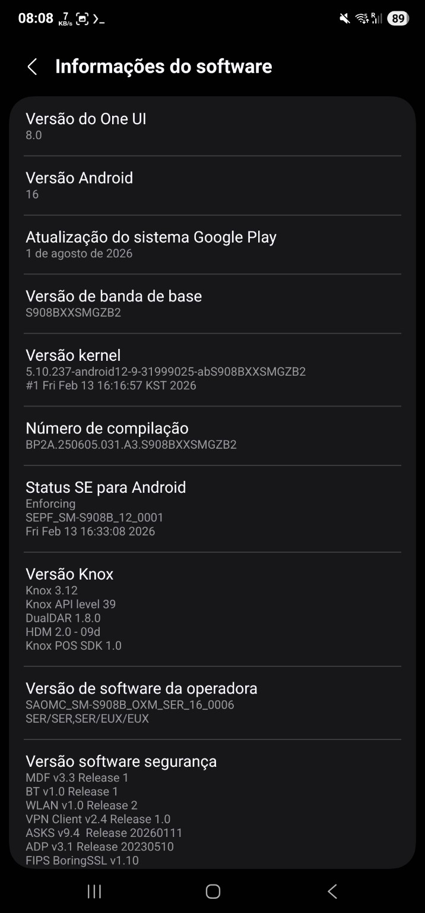

# SM-S908B S908BXXSMGZB2 validation

This profile was validated on a Galaxy S22 Ultra `SM-S908B` running the exact
firmware and kernel below.

| Field | Value |
| --- | --- |
| Model | `SM-S908B` |
| Device | `b0s` |
| SoC | Exynos 2200 / s5e9925 |
| Firmware | `S908BXXSMGZB2` |
| Build | `BP2A.250605.031.A3.S908BXXSMGZB2` |
| Android | 16 / API 36 |
| Page size | 4096 |
| Kernel | `5.10.237-android12-9-31999025-abS908BXXSMGZB2` |

The hardware-verified path runs through Root My Galaxy in Shizuku mode. The
payload resolves the virtual KASLR slide, independently scans the 64 possible
0x8000-aligned physical KASLR slots, accepts a slot only when an 8-byte read
matches the `fake_fops` value created by the current attempt, establishes
physical kernel read/write, and reaches bootstrap root. The app then performs
the KernelSU late-load and verifies the KernelSU control channel.

The physical address model used by the validated build is:

```text
PHYS_OFFSET / memstart_addr:    0x80000000
kernel physical base pre-slide: 0x80000000
Image text offset:              0x0
physical KASLR granularity:     0x8000
physical KASLR candidates:      64
```

Physical and virtual KASLR are kept as separate address domains. Their values
happened to be equal in the five recorded full-path runs below; the slot
selection does not depend on that equality.

## Initial hardware validation (previous reference)

Five recorded full-path runs completed bootstrap root and KernelSU late-load with the previous payload revision.

| Run | Physical slot | Physical slide | Virtual slide | Successful attempt | PhysRW | UID | KernelSU |
| ---: | ---: | ---: | ---: | ---: | --- | --- | --- |
| 01 | 54 | `0x1b0000` | `0x1b0000` | 1 / 24 | `read/write + rw64` | `2000 -> 0` | control verified |
| 02 | 9 | `0x048000` | `0x048000` | 4 / 24 | `read/write + rw64` | `2000 -> 0` | control verified |
| 03 | 42 | `0x150000` | `0x150000` | 3 / 24 | `read/write + rw64` | `2000 -> 0` | control verified |
| 04 | 59 | `0x1d8000` | `0x1d8000` | 5 / 24 | `read/write + rw64` | `2000 -> 0` | control verified |
| 05 | 9 | `0x048000` | `0x048000` | 2 / 24 | `read/write + rw64` | `2000 -> 0` | control verified |

Runs that did not obtain an exact physical-slot match returned to the external
supervisor and retried with a fresh child. In the five successful records, the
final path reached `read_ok=1`, `write_ok=1`, `rw64=1/1`, `uid=2000->0`, and
then completed KernelSU control-channel verification.

## Cleanup-hardened hardware validation

The current payload adds `reset_pipe_attempt()` immediately before the CFI
failure path returns status 70 to the external supervisor. It was tested again
on the same physical device through the official Root My Galaxy execution path,
with a reboot between every run.

| Run | Log | Physical slot | Physical slide | Successful attempt | Result |
| ---: | --- | ---: | ---: | ---: | --- |
| 01 | [143649](validation/SM-S908B-S908BXXSMGZB2/2026-09-04-official-app/RootMyGalaxy-20260904-143649-succeeded.log.txt) | 61 | `0x1e8000` | 7 / 24 | root + KernelSU |
| 02 | [144652](validation/SM-S908B-S908BXXSMGZB2/2026-09-04-official-app/RootMyGalaxy-20260904-144652-succeeded.log.txt) | 24 | `0x0c0000` | 7 / 24 | root + KernelSU |
| 03 | [145430](validation/SM-S908B-S908BXXSMGZB2/2026-09-04-official-app/RootMyGalaxy-20260904-145430-succeeded.log.txt) | 30 | `0x0f0000` | 1 / 24 | root + KernelSU |
| 04 | [145742](validation/SM-S908B-S908BXXSMGZB2/2026-09-04-official-app/RootMyGalaxy-20260904-145742-succeeded.log.txt) | 0 | `0x000000` | 2 / 24 | root + KernelSU |
| 05 | [150418](validation/SM-S908B-S908BXXSMGZB2/2026-09-04-official-app/RootMyGalaxy-20260904-150418-succeeded.log.txt) | 59 | `0x1d8000` | 1 / 24 | root + KernelSU |
| 06 | [150955](validation/SM-S908B-S908BXXSMGZB2/2026-09-04-official-app/RootMyGalaxy-20260904-150955-succeeded.log.txt) | 51 | `0x198000` | 1 / 24 | root + KernelSU |
| 07 | [151659](validation/SM-S908B-S908BXXSMGZB2/2026-09-04-official-app/RootMyGalaxy-20260904-151659-succeeded.log.txt) | 50 | `0x190000` | 5 / 24 | root + KernelSU |

Result: **7 / 7 successful full-path runs**. All seven reached PhysRW,
`uid=2000 -> 0`, KernelSU late-load, and final control-channel verification.
No kernel panic was observed.

Across the seven runs, the new cleanup marker was reached 17 times before an
external-supervisor retry. Several runs also recovered from intermediate pipe
or `read64` misses inside the successful child. No
`F_SETPIPE_SZ: Operation not permitted` failure was observed in this set.

The original `F_SETPIPE_SZ` failure was not deliberately reproduced here, so
this is not presented as a direct reproduction-and-fix of that specific error.
The source-level lifecycle issue was corrected and the rebuilt binary was then
validated for regression and stability on hardware.

The raw logs and a compact index are available in
[`docs/validation/SM-S908B-S908BXXSMGZB2/2026-09-04-official-app/`](validation/SM-S908B-S908BXXSMGZB2/2026-09-04-official-app/).

## KernelSU

The late-load package used for these runs was **not built specifically for
SM-S908B GZB2**. It is the S901B / `S901BXXSNGZD7` KDP pair from
`enej-git/Root-My-Galaxy-Payloads` PR #138, commit
`40fcda771d637f1ae5ddae7ebe3ba8264f347395`. The exact files are included
byte-for-byte in this PR so the S908B integration does not depend on another
open branch:

- `kernelsu/ksud-r0s-S901BXXSNGZD7-kdp`
- `kernelsu/android12-5.10_kernelsu-r0s-S901BXXSNGZD7-kdp.ko`

Their original identities are:

| File | Bytes | SHA-256 |
| --- | ---: | --- |
| `ksud-r0s-S901BXXSNGZD7-kdp` | 4621280 | `fc0097be827dab2078ba23e7af223905cc8ab38c763a602982071439ae7ed962` |
| `android12-5.10_kernelsu-r0s-S901BXXSNGZD7-kdp.ko` | 323168 | `47a66801c8a1e94a757924fd30099065cea62edc80e14b83b0879cca22fef568` |

On this SM-S908B GZB2 device, the candidate completed late-load and
control-channel verification in every full-path run currently documented
above. KernelSU Manager v3.2.5 (`32525-2`) reports `<LKM> [Jailbreak mode]` on
the exact `abS908BXXSMGZB2` kernel. An external Termux check returns:

```text
$ su -c id
uid=0(root) gid=0(root) groups=0(root) context=u:r:ksu:s0
```

This is hardware evidence of empirical compatibility for this tested
combination. It does not claim that S901B KernelSU artifacts are generally
interchangeable with S908B firmware or with other kernel builds.

## SELinux runtime note

The IonStack root path reads the runtime SELinux enforcing byte and temporarily
writes it from `1` to `0` before invoking the usermode helper. The available
source does not contain a corresponding write that restores this byte to `1`.

KernelSU Manager reported SELinux Enforcing after the completed app flow.
That final state is recorded as an observation. The available logs and source
do not establish which component restored Enforcing, so this document does
not attribute the restoration to IonStack's `root.c`.

## Device evidence

| Root My Galaxy | KernelSU Manager |
| --- | --- |
|  |  |

| Root shell | Software identity |
| --- | --- |
|  |  |

## Source and reproducibility

Both published payload revisions come from the IonStack source state based on
`sarabpal-dev/IonStack-S22U` commit
`2b4e8a64b78d18f236f0d5b26cfd204bc46363ce`. The current revision differs by
the documented retry cleanup call only. CI uses Android NDK r28c
(`28.2.13676358`), API 35 for the main payload and API 28 for the embedded
ARM32 stage. The public provenance copy is
at `src/targets/b0s-S908BXXSMGZB2/ionstack-s908b-gzb2/` and preserves the
build-relevant files from that reproduced state. The only omitted CI-snapshot
file is the non-build `MEMORY.md` developer notebook; the pinned `.gitignore`
is retained.

The nested upstream README, some inherited target-header comments, and an
unused legacy `BUILD_FINGERPRINT` macro still refer to earlier SM-S908W/b0q or
QEMU porting provenance. The immutable embedded ARM32 stage also prints the
historical banner `CVE-2026-43499 32-bit ARM stage (b0q)`. These strings are
provenance/debug labels, not target-selection data. They are deliberately
documented rather than rewritten so this contribution does not silently clean
up the already-reproduced source state or replace the hardware-tested binary.
Device identity and validation claims in this document are based on the exact
GZB2 hardware records and artifact hashes.

A clean CI reproduction rebuilt the payload and embedded ARM32 stage and
required byte-for-byte identity with the hardware-tested artifacts. The
reproduction completed with:

```text
PAYLOAD_REPRODUCED=PASS
payload SHA-256: d2b52dc52a69571a145a64f0f57ae53884383a996661066ca84b52a45eb691bf
exp32 SHA-256:   023190461719fc4cc11a7d114ff8da5132f1afa0eba32c907053e83682914152
```

The public path uses neutral target naming; `golden` is only an internal label
for the immutable hardware-reference build.

## Validated artifact

The current native payload is staged at
`artifacts/b0s-S908BXXSMGZB2/cve-2026-43499-app.so`. It is the
cleanup-hardened build used for the seven official-app-path hardware runs above.
It retains the same validation instrumentation and embedded ARM32 stage as the
previous revision.

| Revision | Artifact | Bytes | SHA-256 |
| --- | --- | ---: | --- |
| Current cleanup-hardened build | `artifacts/b0s-S908BXXSMGZB2/cve-2026-43499-app.so` | 1757752 | `d2b52dc52a69571a145a64f0f57ae53884383a996661066ca84b52a45eb691bf` |
| Previous hardware reference | Git history / initial five-run record | 1757688 | `19a219a94660a60c06a4c34f9a873b5c9ccacda7129d409ba8486ffe61453235` |

The previous identity is kept here explicitly so the tested artifact history is
not silently replaced.

Additional validation-build identities retained for provenance are:

| Component | SHA-256 |
| --- | --- |
| Embedded ARM32 stage | `023190461719fc4cc11a7d114ff8da5132f1afa0eba32c907053e83682914152` |
| S901B GZD7 KDP late-load candidate | `fc0097be827dab2078ba23e7af223905cc8ab38c763a602982071439ae7ed962` |
| Initial validation APK | `536851643977e1bd41bbec314fe78846218387dae153b81a1462c6622bb5bd14` |

The exploit/root state is volatile. A reboot removes the runtime root and
late-loaded KernelSU state; the bootstrap/late-load path must be run again.
No boot image was flashed.

The exploit profile is exact-build validation for `SM-S908B /
S908BXXSMGZB2`. Compatibility with other S22 variants, firmware revisions,
or kernel builds is not asserted. The KernelSU note above is intentionally
separate because its late-load artifact originated from the S901B GZD7
candidate rather than an S908B exact-build module.
